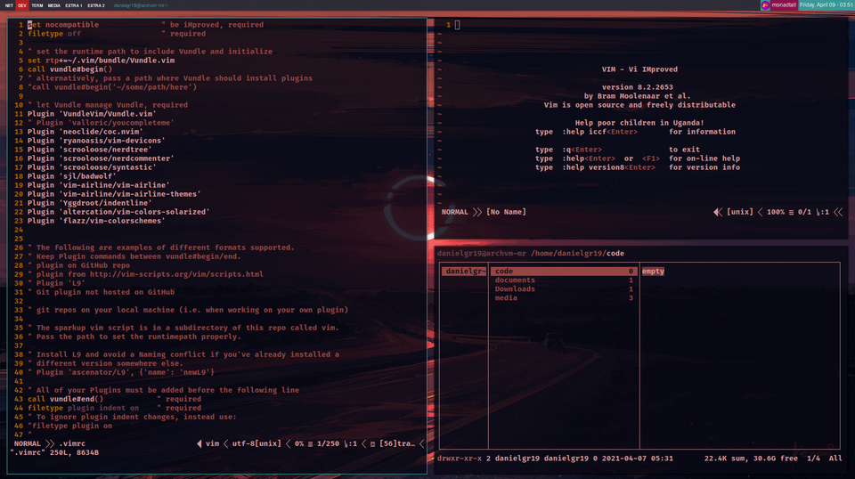

<h1>ARCH LINUX OS ULTIMATE 💻</h1>
<p><b>Arch Linux OS </b> - System configuration, dotfiles and installation, an os for pure coding and it requires very low end resources to run, great for old machines and excellent for coding.</p><br>
<p><a href="https://archlinux.org/">Arch</a> its the main distribution, an <b>light-minimal GNU/LINUX base system</b> that maintain the latest stable release versions of Linux. For our enviroment we use <b>Qtile</b>, an excellent Window Manager that allow us to control all our pc with only the keyboard, using <b>VIM</b> for the most part of the code editing and <b>Ranger</b> for manipulate all our files.</p>
<hr>

<p><i>Arch running on AMD C50 (1.0 GHz), 2GB RAM</i></p>
<hr>
<h2>Window Manager: Qtile</h2>
<p><a href="http://www.qtile.org/">Qtile</a> its going to be your<b>Desktop Enviroment Taste</b> for this OS Build, fast and very customizable, Qtile its going to give us a fast coding experience with his Window Managing System lightweight that can even run smoothly on 1.0 GHz Proccesor's</p>
<br>
<p>Once Arch its already instaled (<a href="https://wiki.archlinux.org/index.php/Installation_guide#Installation">Arch installation guide</a>) we need to install an Desktop Enviroment, to install Qtile follow these 3 steps</p>


```
Arch itArch its alrea Arch its alrea Arch its alrea Arch its alrea
